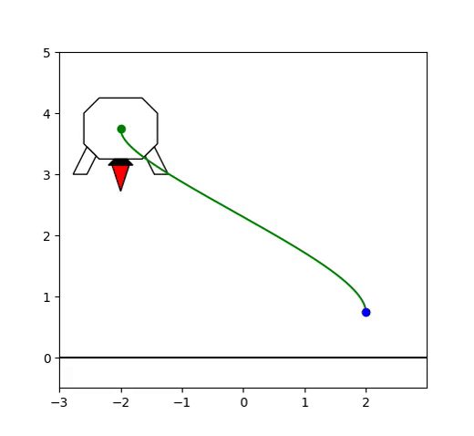
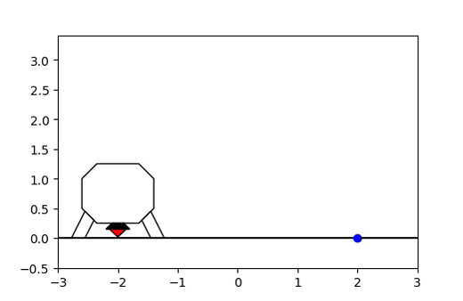
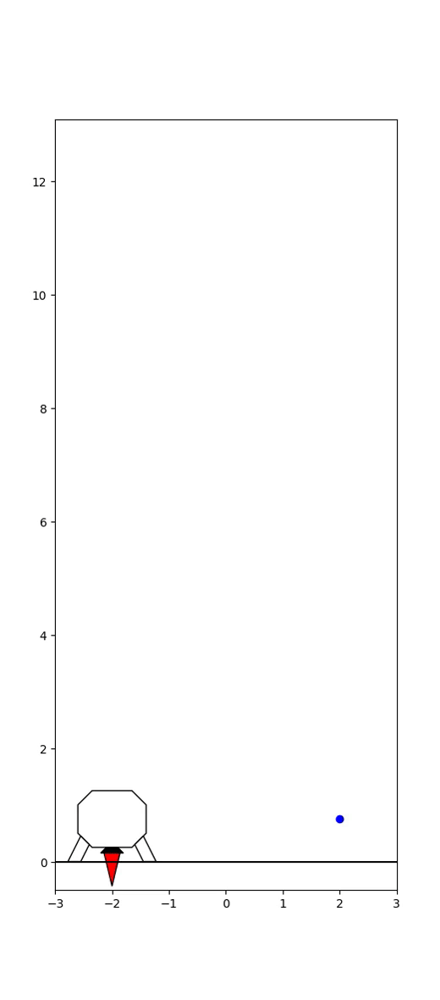

# LunarLander
Example of optimal trajectory with path shown.

Low gravity example with $$g = 0.1 \frac{m}{s^2}$$.

A flip can be achieved by setting the initial angle to $$2\pi$$, and the final angle to $$0$$.

